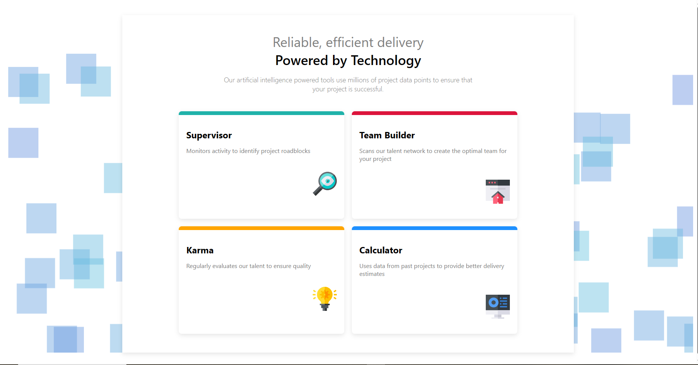

# Frontend Mentor - Four card feature section solution

This is a solution to the [Four card feature section challenge on Frontend Mentor](https://www.frontendmentor.io/challenges/four-card-feature-section-weK1eFYK). Frontend Mentor challenges help you improve your coding skills by building realistic projects. 

## Table of contents

- [Overview](#overview)
  - [The challenge](#the-challenge)
  - [Screenshot](#screenshot)
  - [Links](#links)
- [My process](#my-process)
  - [Built with](#built-with)
  - [What I learned](#what-i-learned)
  - [Continued development](#continued-development)
- [Author](#author)

**Note: Delete this note and update the table of contents based on what sections you keep.**

## Overview

### The challenge

Users should be able to:

- View the optimal layout for the site depending on their device's screen size

### Screenshot

### Links

- Solution URL: [https://github.com/Ontologeist/four-card/tree/main]
- Live Site URL: [https://ontologeist.github.io/four-card/]

## My process

### Built with

- Semantic HTML5 markup
- CSS custom properties
- Flexbox

### What I learned
- Learned to plan my code with sketches and noting common style elements
- Learned how to round a border to create a nice style to page sections

### Continued development

- I would like to learn how to make the individual "card" elements more responsive so they stack from the middle and have more than the binary placement (4 stack vs tower)

## Author

- Frontend Mentor - [@Ontologeist](https://www.frontendmentor.io/profile/Ontologeist)

